# 🚗 AutoParts Management System

A JavaFX desktop application connected to a MySQL database for managing an auto parts business.

## 📌 About the Project

AutoParts Management System helps manage:

* Branches
* Warehouses
* Employees
* Suppliers
* Products
* Inventory
* Sales

The system has two main sides:

* **Manager side** for managing business data.
* **Employee side** for sales and cashier operations.

## ✨ Features

### 👨‍💼 Manager

* Manage branches
* Manage warehouses
* Manage employees
* Manage suppliers
* Manage categories
* Manage products
* Manage branch inventory
* Manage warehouse inventory
* View low-stock products

### 🧾 Employee / Cashier

* View available products
* Add products to cart
* Create sales orders
* Generate receipts
* Update inventory after sales

## 🛠️ Technologies Used

* Java
* JavaFX
* MySQL
* JDBC
* Maven
* IntelliJ IDEA

## 🗄️ Database

Database name:

```sql
AutoPartsDP
```

Main tables include:

* Branch
* Warehouse
* Employee
* Manager
* Supplier
* Customer
* Category
* Product
* Branch_Inventory
* Warehouse_Inventory
* Sales_Order
* Payment

## 🔐 Test Login Accounts

### Manager

```text
Username: ismael
Password: 1234
```

### Employees

```text
Username: ali
Password: 1234
```

```text
Username: sara
Password: 1234
```

## ▶️ How to Run

1. Clone the repository:

```bash
git clone https://github.com/your-username/AutoParts.git
```

2. Open the project in **IntelliJ IDEA**.

3. Create the MySQL database by running the SQL file.

4. Make sure the database connection uses:

```java
String url = "jdbc:mysql://localhost:3306/AutoPartsDP";
String user = "root";
String password = "your_mysql_password";
```

5. Run the main class:

```text
com.example.autoparts.Main
```

## ⚠️ Notes

* Branches must be added before employees.
* Products must be added before inventory.
* Phone numbers are unique.
* Employee usernames are unique.
* Default test password is `1234`.

## 👤 Author

Developed by **Ismael Alami**
COMP333 Database Project

## 📸 screenshots

### 🔐 Login
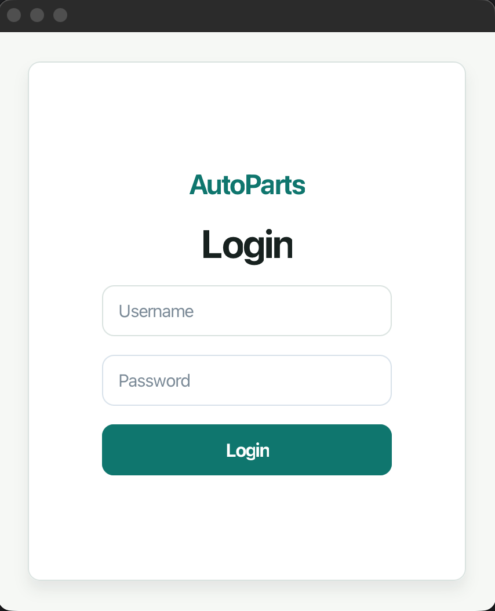

### 📊 Dashboard
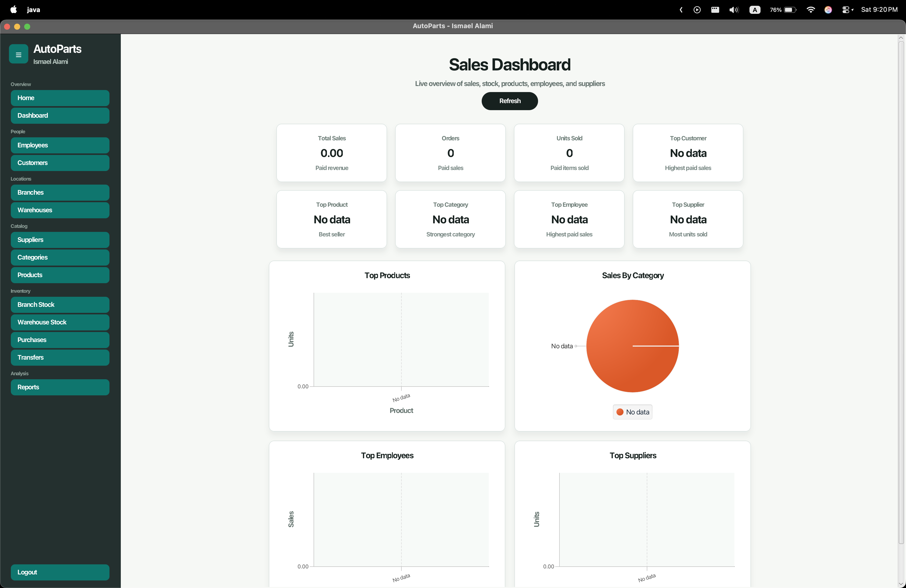

### 🏢 Branches
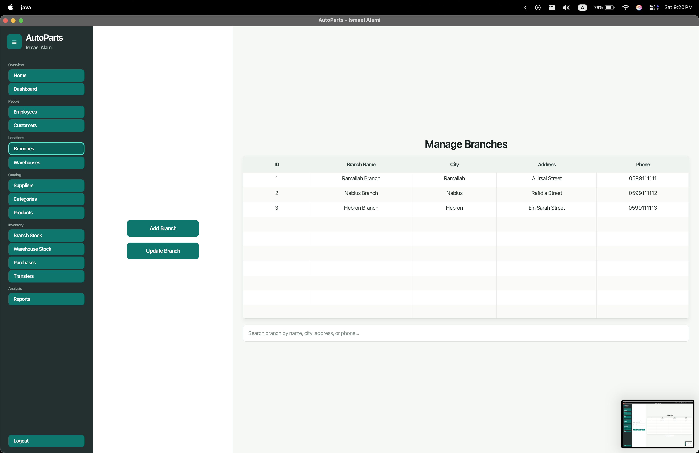

### 🏢 Branch Inventory
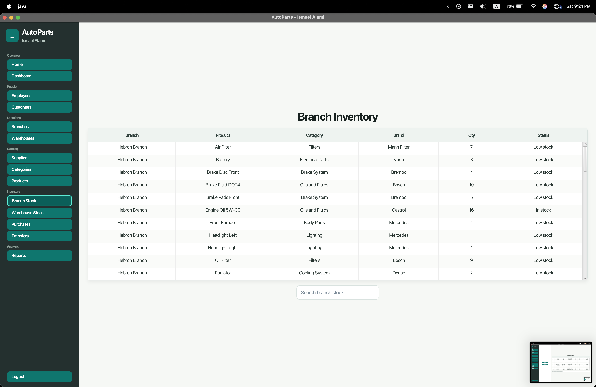

### 🔗 Branch Products
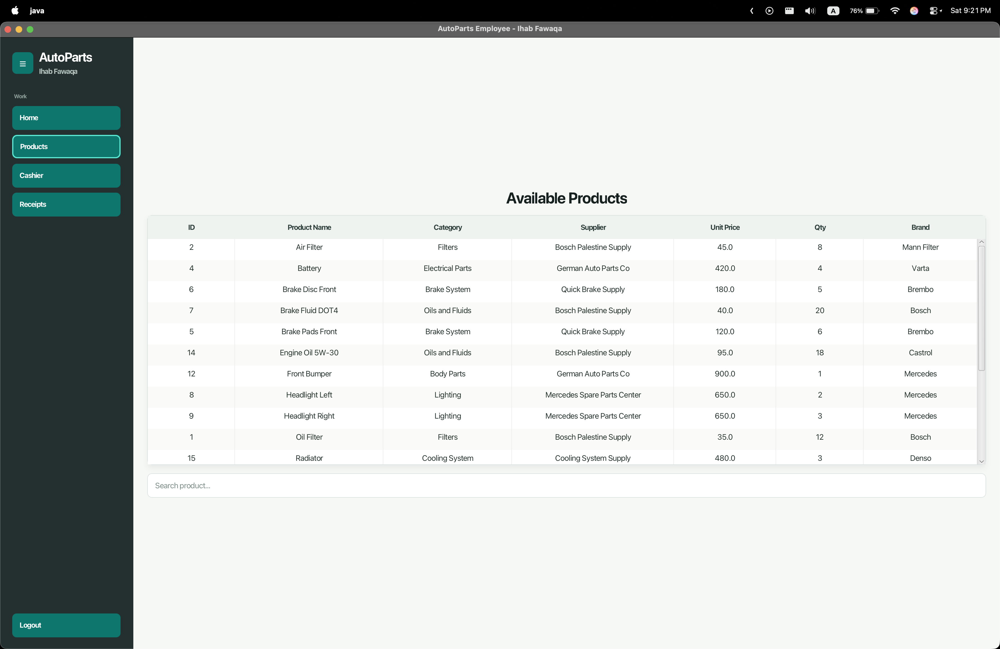

### 💵 Cashier
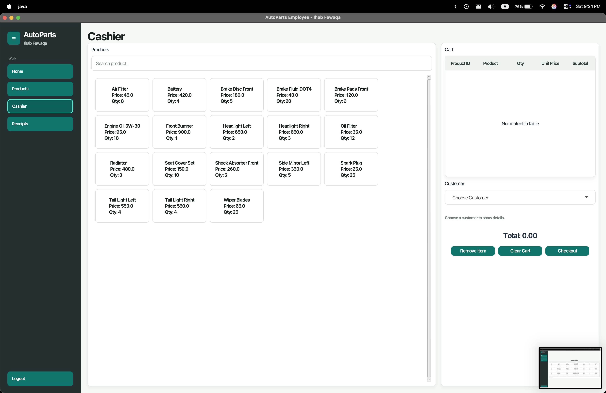

### 🗂️ Categories
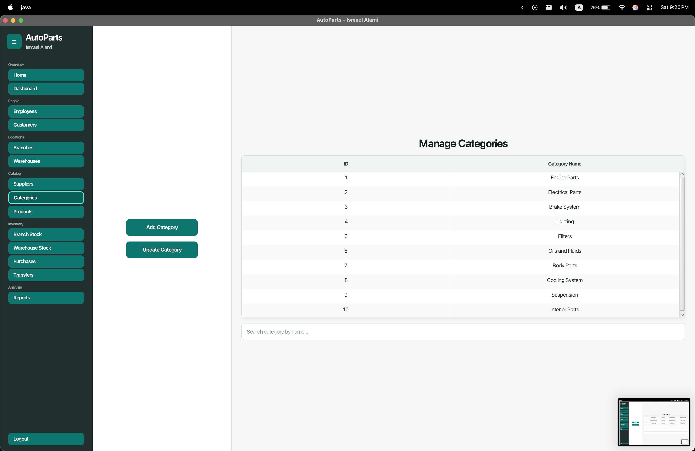

### 👤 Customers
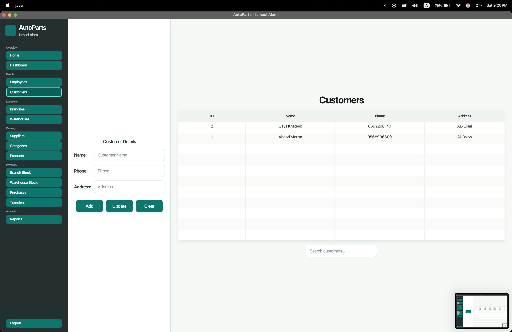

### 👥 Manage Employees
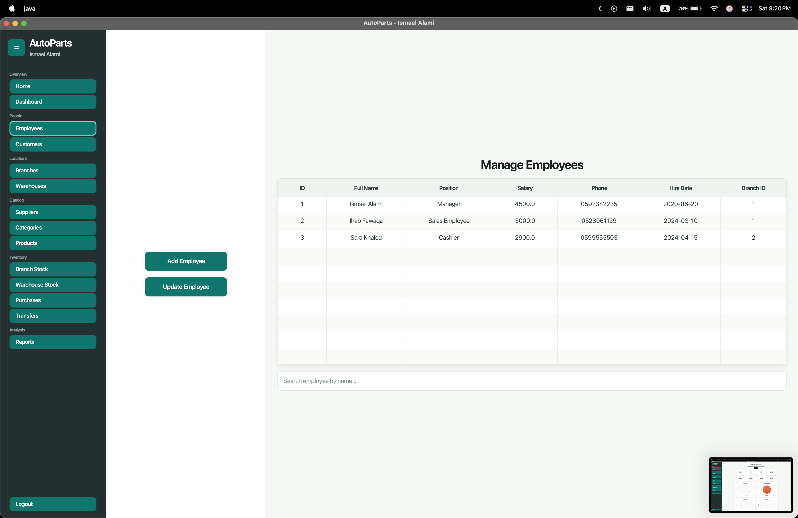

### 📦 Products


### 🧾 Receipts
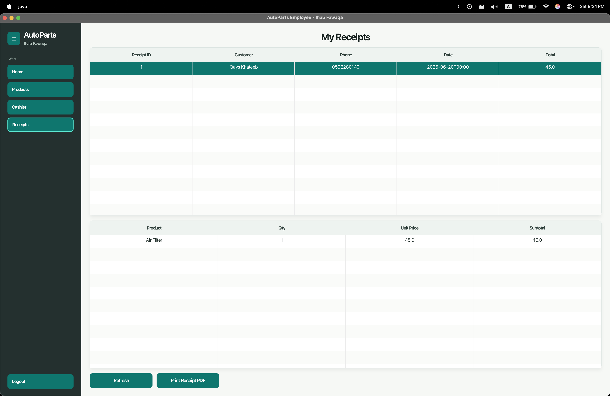

### 📈 Reports
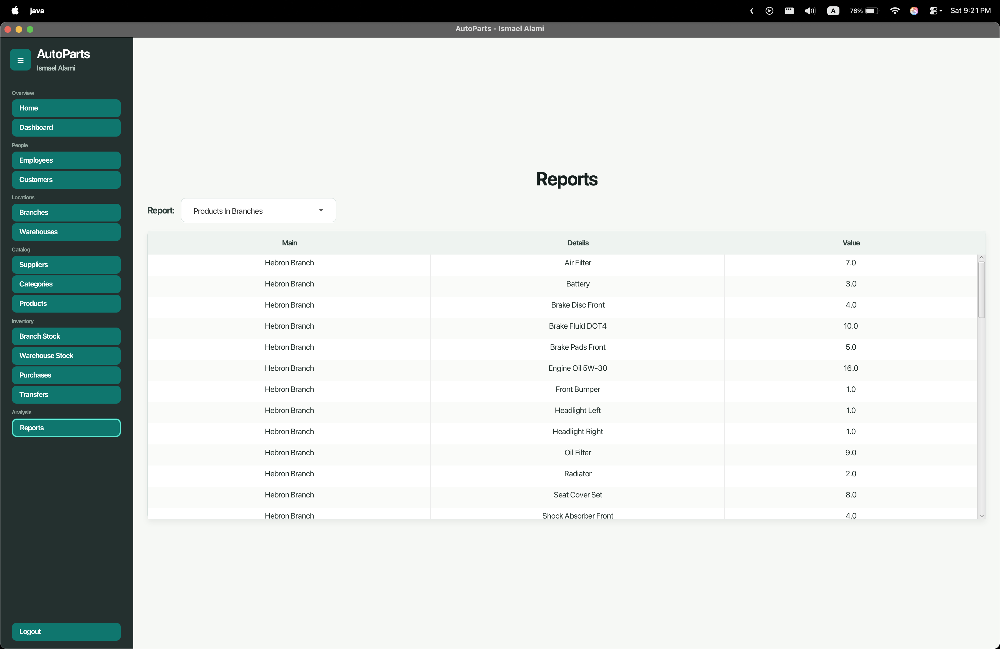

### 🚚 Suppliers


### 🏬 Warehouse Inventory


### 🏬 Warehouses
